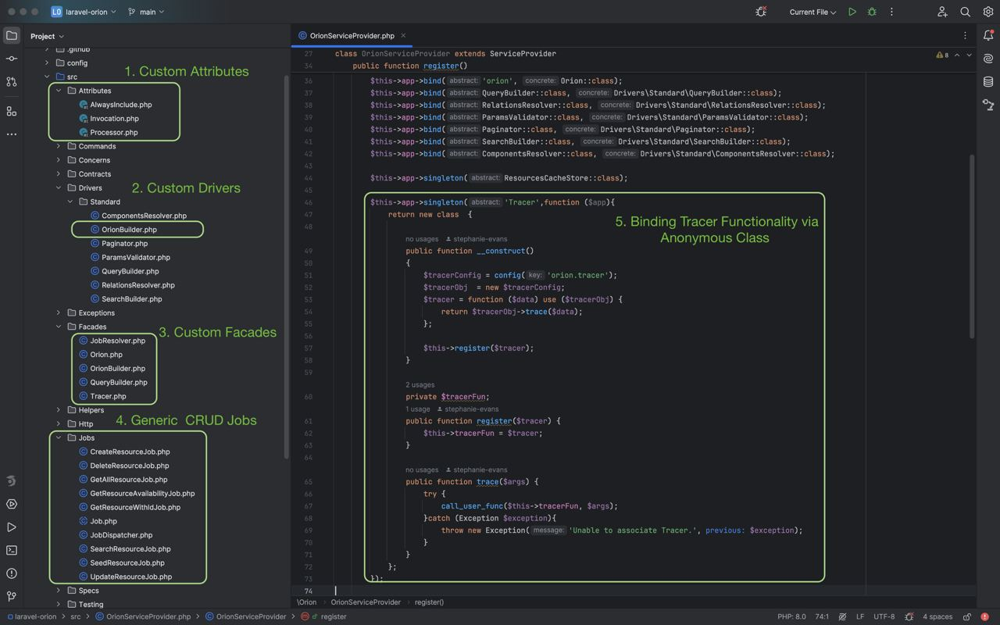

## Introduction
Laravel Orion allows you to build a fully featured REST API based on your Eloquent models and relationships with simplicity of Laravel as you love it.

Documentation for Laravel Orion can be found on the [website](https://tailflow.github.io/laravel-orion-docs/).

## Hunter : Repository Documentation
Orion for Laravel is the simplest way to create REST API with Laravel

**Hunter** is  fork of the original Orion for Laravel, it represents unique combination of latest PHP language features at the time like "Attributes" merging with intrinsic Laravel functionalities like **"Drivers" , "Managers" & " Jobs"**.

Demonstrates effective use of Database-First Development Approach with MVVM Design Methodologies : 
1. Scale laravel Applications with use of Jobs for basic CRUD functionality.
2. Increase speed of Development to shorten Time to Market of  new features.
3. Less prone to errors as the code is auto-generated.
4. Auto-Compliance to various PSR standards.
5. Tiny Controller codebase.
6. Tracer is an ingenious way for the library to pass on the logs to Application specific Logger removing any inherent vendor locked-in dependency.

## Code Highlight 

## License

The Laravel Orion is open-source software licensed under the [MIT license](https://opensource.org/licenses/MIT).
